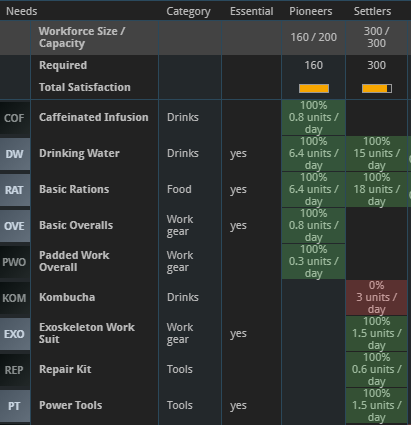
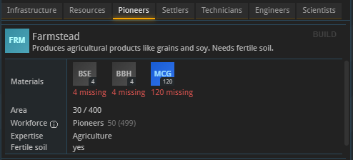
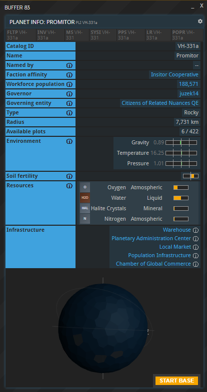

## General information

Each Production Line operates at a certain efficiency when active. Efficiency dictates how long a production order takes to finish: lower efficiency results in longer production times, higher efficiency shortens them. A Production Line's current efficiency can be looked up in its Production queue buffer (PRODQ):

Building condition, worker availability, and satisfaction provide the base efficiency value. Experts grant bonuses to that value for Production Lines in their field of expertise. Active CoGC programs may also benefit certain industries or worker types. Finally, soil fertility (or lack thereof) provides another bonus (or penalty) to the efficiency of certain Production Lines.

### Building condition

Production buildings are most efficient right after construction, then they start to deteriorate. The deterioration slowly increases over time until the building operates at only 33 % of its original efficiency, at which point it no longer deteriorates. It is worth noting that all buildings can (and should) be repaired once they are considered as too inefficient.

### Worker availability

Each Production line employs a certain amount and type of workers, which is indicated under „Workforces“ in its BUI window:

If only part of the workforce required is available, the building can still operate, but at a lower efficiency. Multiple buildings requiring the same workforce are added up.

Besides the satisfaction level (more on that below), the Population window lists three metrics for each worker type:
1. Population Size: The actual amount of workers present in your base. Determines the rate at which consumables are used up.  
2. Capacity: The amount of workers your base can currently hold.  
3. Required: The amount of workers all your Production Lines combined can employ.  

The following rules apply:  
- If Capacity is smaller than Required, the efficiency of all Production Lines requiring the respective type of workforce is impacted negatively. More precisely, the efficiency is multiplied with the percentage of workers available, i.e.: _Efficiency x (Population Size / Required)_  
- If Capacity is bigger than Required, the Habitation Modules are not filled up completely, meaning the actual number of workers present – the Population Size – is below Capacity.  
- All Production Lines employ workers even when no orders are queued or production is halted. Idle workers cannot be moved from one building to another.  

### Worker satisfaction

Each type of worker has their own needs that need to be fulfilled in order to keep efficiency up. Worker needs can be looked up in a base's Population window. For example, 100 Pioneers need 4 DW, 4 RAT, 0.5 OVE, 0.5 COF, and 0.2 PWO per day to be fully satisfied, and 100 Settlers need 5 DW, 6 RAT, 0.5 EXO, 0.5 PT, 1 KOM, and 0.2 REP.

Efficiency stays at 100% if both luxury and non-luxury needs are met, and less if only essentials are available. Pioneers, for example, will be at 79% satisfaction with only DW, RAT, and OVE available to consume. A workforce will keep working for as long as at least one of their essential resources is still at their disposal. Only once all of them run out, production will stop. If only part of the required resources is available, the workforce's satisfaction decreases and hence its productivity suffers.

Some consumables are so-called non-essentials: The productivity loss caused by a missing non-essential is lower than for essential consumables. Plus, a workforce will stop working altogether if the only consumable at their disposal is non-essential. The Population buffer lists which consumables are essential and which aren't:

#### How consumables are used up

The first full amount of any consumable required for the following 24 hours (e.g. 4 RAT for 100 Pioneers) is claimed by a base's population (and thus disappears from the inventory) as soon as the commodity becomes available in the base's inventory. The same happens again 24 hours later, again and again until the consumable is used up. This goes for each type of consumable individually: If a population starts consuming DW at 12 PM and RAT at 4 PM, the next batch of DW will be used up at 12 PM the next day, and the next batch of RAT will be used up at 4 PM the next day.

__Note: No production needs to be running for a population to be consuming resources!__ Idle workforces have the exact same needs as active ones and will still use up consumables in the base's inventory.

### Experts

All buildings can be granted bonuses by so-called experts. You can see your experts by pressing the EXPERTS button in your base. To utilize them, hit ACT (Activate); to remove their bonus, hit RMV (Remove).

Each expert grants a bonus to a certain industry. Each industry, in turn, encompasses different buildings:

| Expertise	   			| buildings (+ BUI tickers)														|
|-----------------------|-------------------------------------------------------------------			|
| Resource Extraction	| Collector (COL), Extractor (EXT),	Rig (RIG), Incinerator (INC)				|
| Manufacturing  		| Basic Materials Plant (BMP), Textile Manufacturing (CLF), 3D Printer (PPF), Weaving Plant (WPL), Medium Component Assembly (MCA), Small Components Assembly (SCA), Appliances Factory (APF), Spacecraft Prefab Plant (SPP), Advanced Appliances Factory (AAF), Spacecraft Propulsion Factory (SPF)	|
| Agriculture  			| Farmstead (FRM), Hydroponics Farm (HYF), Orchard (ORC)										|
| Food Industries		| Food Processor (FP), Fermenter (FER), In-Vitro Plant (IVP) |
| Construction			| Prefab Plant MK1 (PP1), Welding Plant (WEL), Prefab Plant MK2 (PP2), Unit Prefab Plant (UPF), Prefab Plant MK3 (PP3), Prefab Plant MK4 (PP4) |
| Metallurgy			| Smelter (SME), Metalist Studio (FS), Glass Furnace (GF), Hull Welding Plant (HWP), Ship Kit Factory (SKF), High-Power Blast Furnace (ASM) |
| Chemistry				| Chemical Plant (CHP), Polymer Plant (POL), Laboratory (LAB), Pharma Factory (PHF), Technetium Processing (TNP), Advanced Material Lab (AML), Einsteinium Enrichment (EEP) |
| Fuel Refining			| Refinery (REF) |
| Electronics			| Electronics Device Manufactory (EDM), Cleanroom (CLR), Electronics Plant (ELP), Energy Component Assembly (ECA), Software Development (SD), Drone Shop (DRS), Software Engineering (SE), Software Labs (SL) |

#### Expert spawn rates & bonuses

The first experts of any company are included in its [starter package](../packages-factions), but all following experts will appear over time. __Keeping a Production Line running__ will eventually create a new expert in its field, e.g. producing goods with a Farmstead will generate Agriculture experts over time. After a total of 5 experts is reached in one particular industry, no new experts will be created in that industry. A total of 5 experts can be active _per industry_ and a total of 6 experts at a time can be active across _all industries_ in a base.

| Expert no.	| Days required | Bonus		   |
|---------------|---------------|--------------|
| 1			   	| 10.00 		| 3.06%	   	   |
| 2			   	| 12.50		   	| 6.96%	 	   |
| 3			   	| 57.57		   	| 12.48%	   |
| 4			   	| 276.50	   	| 19.74%	   |
| 5			   	| 915.10	   	| 28.40%	   |

The days indicated above relate to a single building at 100% efficiency. Operating two buildings in the same industry, i.e. within the same Expertise category, will cut the required time in half, operating three will bring it down to a third etc. This also happens when both buildings are part of the same Production Line, e.g. two (three, four, five...) Farmsteads will bring the time down equally.

Do note that the **Days Required** accumulation is reset after each expert. So to go from 0 to 2 experts will take 22.50 days.

The bonus granted by an expert is a fixed value which is simply multiplied with the workforce's efficiency. For example, a workforce operating at 90% efficiency will operate at 101.2% efficiency once 3 experts are activated at the base. `90% * (100% + 12.48%) = 101.2%`

### Soil fertility

The efficiency of certain buildings is impacted by a planet's soil fertility. If this is the case, it will be indicated next to the building's entry in the BSC window. The buildings currently requiring fertile soil are Farmstead (FRM) and Orchard (ORC).

A planet's soil fertility can be seen in its PLI window. The further the yellow bit of the bar reaches to the right, the more fertile it is; the further it reaches to the left, the lower the fertility value. __Note: If there are two dashes instead of a bar, the planet is infertile, meaning that buildings impacted by soil fertility cannot operate at all here.__

Neutral fertility (i.e. no yellow) indicates a modifier of +0%. Poor fertility (yellow left of the center) is a negative modifier, while high fertility (yellow right of the center) is a positive modifier. The further the yellow bar reaches respectively, the bigger its impact, with a maximum range of roughly -33% to +33%.

### CoGC programs

The [Chamber of Global Commerce](../../tutorials/planetary-projects#chamber-of-global-commerce-cogc), if existent on a planet and active, can provide a temporary bonus to productivity. As is the case with experts, the respective percentage is simply added on top. For example, the CoGC program _Education Events: Pioneers_ provdes a 10 % bonus to all pioneer-operated buildings as long as it is active, and the program _Advertising Campaign: Agriculture_ grants a 25 % bonus to all facilities in the agriculture sector.

## About this page

This page is part of the APEX handbook's wiki section. If you are looking for an introduction to APEX, please refer to the [tutorials](../../tutorials).

If you encounter an error or cannot find the answers to your questions, we will gladly help you on our [Discord server](https://discordapp.com/invite/G7gj7PT).
